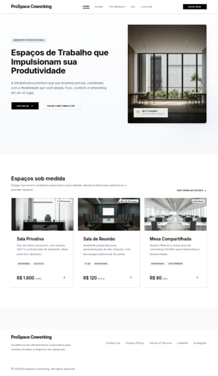
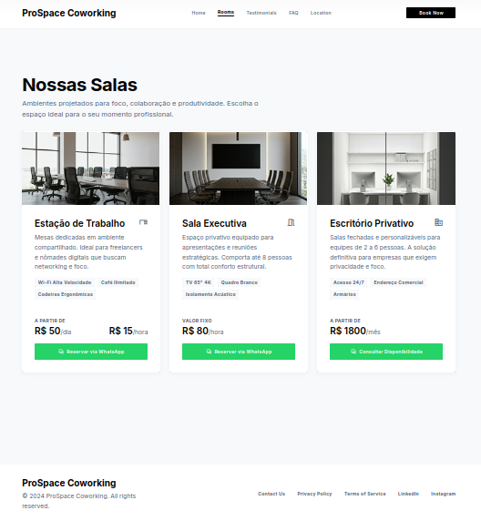
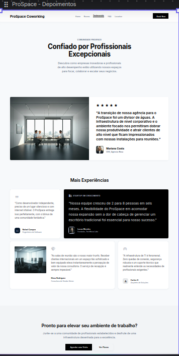
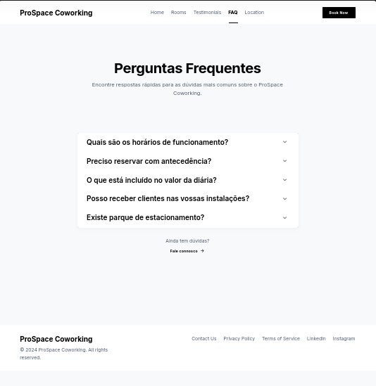
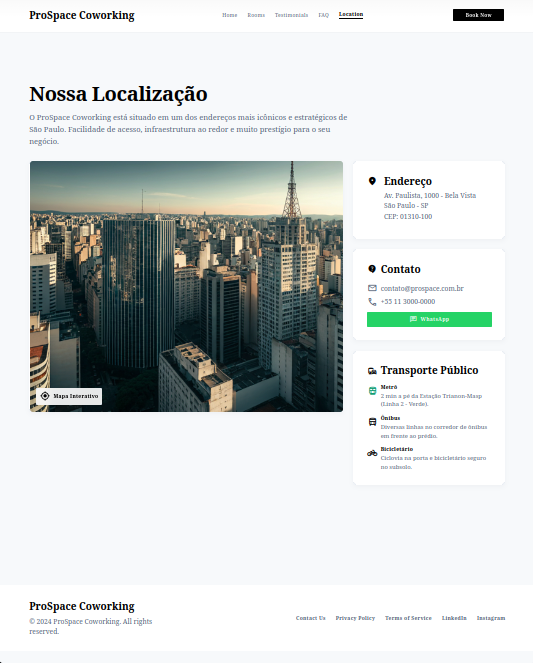

# coworking-space

Landing page para o coworking **ProSpace Coworking**, desenvolvida em HTML, CSS e JS puros, com
dados das salas vindos do Firebase.

## Design

## Divisão da equipe

O projeto está dividido em 5 páginas distribuídas entre 4 integrantes:

| Página      | Arquivo            | Responsável | Requisitos                    |
| ----------- | ------------------ | ----------- | ----------------------------- |
| Início      | `index.html`       | Pessoa 1    | RF05, Hero + preview de salas |
| Salas       | `salas.html`       | Pessoa 2    | RF01, RF02, RF03, RF04        |
| Depoimentos | `avaliacoes.html`  | Pessoa 3    | RF06                          |
| FAQ         | `faq.html`         | Pessoa 4    | RF07                          |
| Localização | `localizacao.html` | Pessoa 4    | RF08                          |

Detalhes completos de cada tarefa, recursos compartilhados (navbar, footer, WhatsApp, schema do
Firestore) e ordem de trabalho: ver [`PLANO-EQUIPE.md`](./PLANO-EQUIPE.md).

## Como rodar

`index.html` é o ponto de entrada. Servir o projeto com um servidor local (ex.: extensão Live
Server do VS Code ou `python3 -m http.server`) para o Firebase funcionar corretamente.
